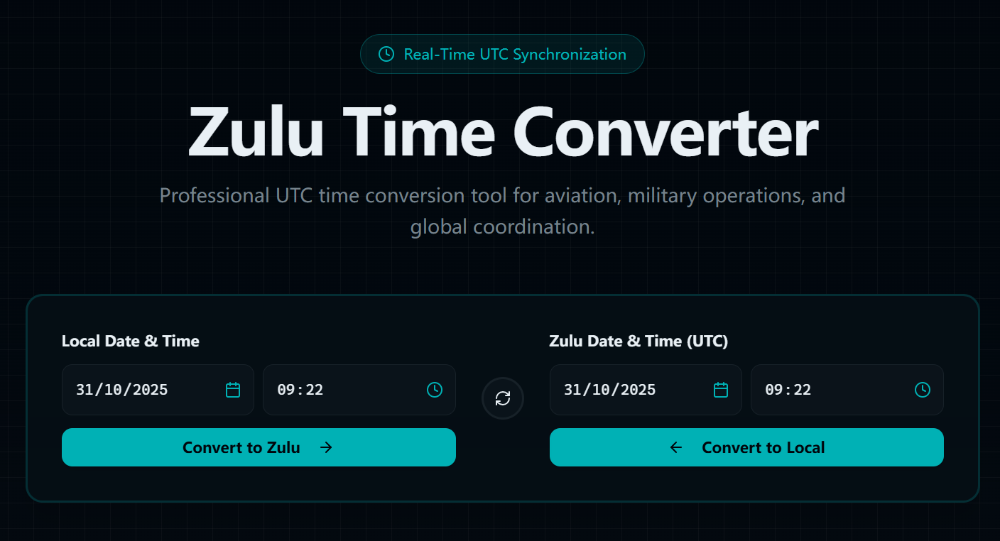
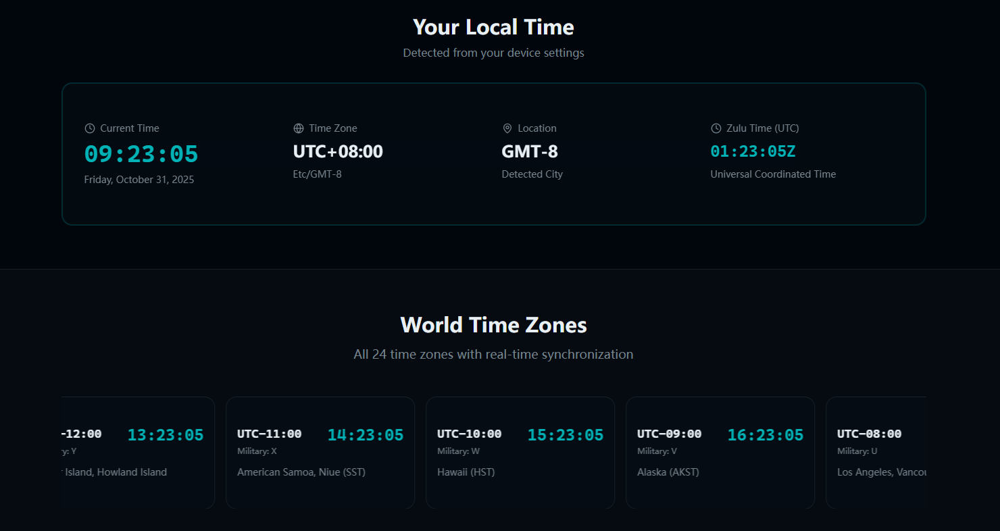

# Zulu Time Converter 🌍

A professional UTC (Zulu Time) converter tool for aviation, military operations, and global coordination. Convert between your local time and Zulu time instantly with real-time synchronization.

## 🌐 Visit the Website

**👉 [Zulu Time Converter/](https://huashengjieguo.github.io/zulu-time-converter/)**

Try the live tool now! Convert time instantly with our professional-grade UTC converter.

## 📸 Screenshots

*Real-time UTC conversion with beautiful interface*

*24 time zones displayed with marquee scrolling animation*

## ✨ Features

### 🕐 Real-Time UTC Clock
- Live UTC/Zulu time display
- Updates every second
- Precise to the second

### 🌍 World Time Zones
- View all 24 time zones simultaneously
- Beautiful marquee display with smooth scrolling
- Shows current time for each timezone
- Highlights your current timezone automatically
- Includes military time codes (Alpha, Bravo, Charlie, etc.)

### ⚡ Instant Time Conversion
- **Local to Zulu**: Convert your local date and time to UTC instantly
- **Zulu to Local**: Convert UTC time to your local timezone
- Easy-to-use date and time pickers
- Click calendar/clock icons for quick selection
- Manual input also supported

### 📍 Your Local Time Display
- Automatic timezone detection
- Shows your current local time
- Displays your timezone offset
- Real-time synchronization

### 🎯 Professional Use Cases
- **Aviation**: Flight scheduling and air traffic control
- **Military**: Operations coordination across time zones
- **Global Business**: International meeting scheduling
- **Scientific Research**: Precise time coordination

## 🚀 Quick Start

Simply visit the website and start converting! No installation required.

1. Enter your local date and time (or use current time) - see the intuitive date and time pickers in the screenshot above
2. Click "Convert to Zulu" to get UTC time instantly
3. Or enter Zulu time and click "Convert to Local" for local timezone conversion

The interface is designed for speed and accuracy - everything you need is right on the homepage!

## 🌟 Key Highlights

- ✅ **100% Free** - No registration, no fees
- ✅ **Real-Time Updates** - Live time synchronization
- ✅ **All 24 Time Zones** - Complete global coverage
- ✅ **User-Friendly** - Intuitive interface, easy to use
- ✅ **Professional Grade** - Accurate and reliable
- ✅ **Mobile Responsive** - Works on all devices
- ✅ **No Ads** - Clean, distraction-free experience

## 📱 Compatible Devices

- 💻 Desktop computers
- 📱 Mobile phones (iOS & Android)
- 📱 Tablets
- 🌐 All modern web browsers

## 💡 Why Use Zulu Time?

**Zulu Time** (also known as UTC - Coordinated Universal Time) is the global standard time reference used in:

- ✈️ **Aviation**: All flight plans and air traffic control use Zulu time to avoid confusion across different time zones
- 🎖️ **Military Operations**: Ensures precise coordination regardless of geographic location
- 🌐 **Global Coordination**: International businesses and scientific research use UTC as a common reference
- 📊 **Weather Reports**: Meteorological data is standardized using UTC

## 🎓 Understanding Zulu Time

- **What is Zulu?** "Zulu" is the NATO phonetic alphabet designation for the letter "Z", which represents UTC
- **No Daylight Saving**: Zulu time does not observe daylight saving time changes
- **Global Standard**: UTC replaced GMT (Greenwich Mean Time) as the time standard in 1972
- **24-Hour Format**: Always displayed in 24-hour format (e.g., 14:30Z)

## 🔗 Usage Examples

### For Pilots
Convert local departure times to Zulu time for flight plans:
- Local: 09:00 AM → Zulu: 14:00Z (example with +5 offset)

### For Military Personnel
Coordinate operations across multiple time zones:
- Mission time: 1800Z → Check local equivalents for all units

### For Business Professionals
Schedule international conference calls:
- Meeting at 15:00Z → Convert to each participant's local time

## 📦 Deployment

The `out` directory contains the static website files ready for deployment to:
- GitHub Pages
- Netlify
- Cloudflare Pages
- Any static web hosting service

Simply upload the `out` directory contents to your web server.

## 🤝 Support

For questions, suggestions, or feedback about the Zulu Time Converter, please visit our website or contact us through the provided channels.

## 📄 License

Free to use for personal and commercial purposes.

---

**Made for professionals who need accurate, real-time time conversion. Fast. Reliable. Free.**

Visit us online to experience the best Zulu Time converter tool available.

